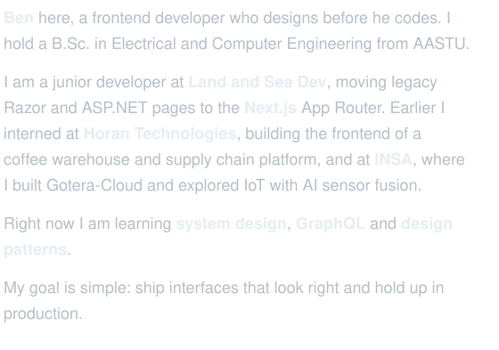
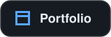
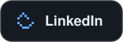
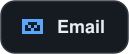
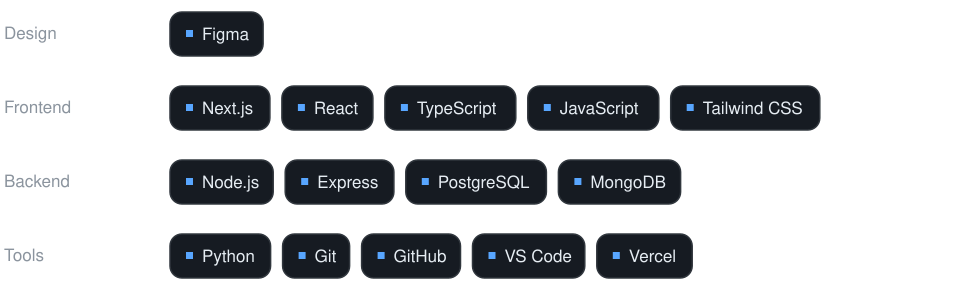

  

  

  

  
  &nbsp;&nbsp;
  

  

  
  
  
  

  

  

  

  

  

  <picture>
    <source media="(prefers-color-scheme: dark)" srcset="https://raw.githubusercontent.com/vbeni30/vbeni30/output/github-snake-dark.svg">
    <source media="(prefers-color-scheme: light)" srcset="https://raw.githubusercontent.com/vbeni30/vbeni30/output/github-snake.svg">
    
  </picture>

