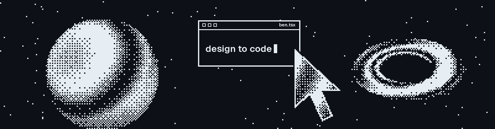

  

# Hi 👋, I'm Ben

**Frontend Developer**

I design interfaces and build them in code.

## 🚀 About Me

<table>
  <tr>
    <td valign="middle">
      
<b>Ben</b> here, a frontend developer who designs before he codes. I hold a B.Sc. in Electrical and Computer Engineering from AASTU.

      
I am a junior developer at <b>Land and Sea Dev</b>, moving legacy Razor and ASP.NET pages to the <b>Next.js</b> App Router. Earlier I interned at <b>Horan Technologies</b>, building the frontend of a coffee warehouse and supply chain platform, and at <b>INSA</b>, where I built Gotera-Cloud and explored IoT with AI sensor fusion.

      
Right now I am learning <b>system design</b>, <b>GraphQL</b> and <b>design patterns</b>.

      
My goal is simple: ship interfaces that look right and hold up in production.

    </td>
    <td width="260" align="center">
      
    </td>
  </tr>
</table>

## 🤝 Connect

## 💻 Tech Stack

## 📊 GitHub Stats

## 📈 Activity Graph

